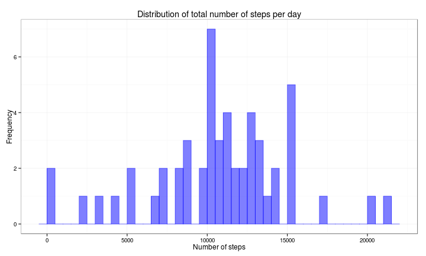
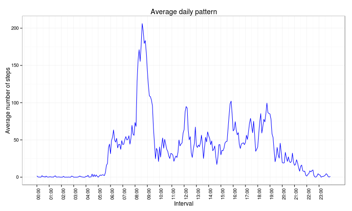
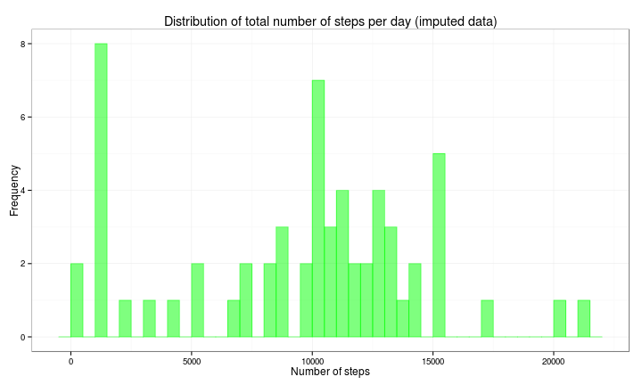
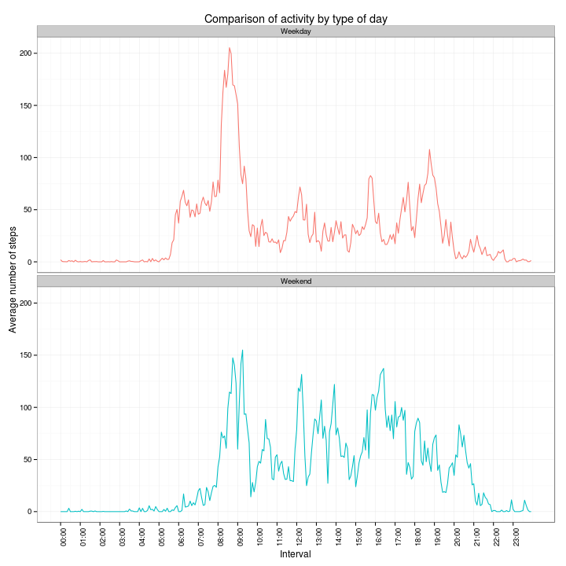

# Reproducible Research: Peer Assessment 1


```r
# knitr configuration
library(knitr)
opts_knit$set(progress=FALSE)
opts_chunk$set(echo=TRUE, message=FALSE, tidy=TRUE, comment=NA,
               fig.path="figure/", fig.keep="high", fig.width=10, fig.height=6,
               fig.align="center")
# load required libs
library(dplyr, quietly=TRUE, warn.conflicts=FALSE)
library(ggplot2, quietly=TRUE, warn.conflicts=FALSE)
```

## Part 1: Loading and preprocessing the data

We read the data set from the file `activity.csv` inside the zip archive
`activity.zip`, assigning the appropriate classes to the columns


```r
# read the data
activity <- read.csv(unz("activity.zip", "activity.csv"), colClasses = c("integer", 
    "Date", "integer"))
```

The summary of the data set indicates that it contains son `NA` values in the
`steps` column:


```r
summary(activity)
```

```
     steps            date               interval   
 Min.   :  0.0   Min.   :2012-10-01   Min.   :   0  
 1st Qu.:  0.0   1st Qu.:2012-10-16   1st Qu.: 589  
 Median :  0.0   Median :2012-10-31   Median :1178  
 Mean   : 37.4   Mean   :2012-10-31   Mean   :1178  
 3rd Qu.: 12.0   3rd Qu.:2012-11-15   3rd Qu.:1766  
 Max.   :806.0   Max.   :2012-11-30   Max.   :2355  
 NA's   :2304                                       
```

Also, it should be noted that for simplicity we read the
`interval` column as integer, but in reality it represents a the start
of a 5-minute interval within a day, with one or two digits for the hour, 
and 2 more digits for the minute part of the time. 

We will convert it to the appropriate format (hh:mm), and then
consider it as an ordered factor. In this way, we can obtain better
labelled plots.


```r
tohhmm <- function(interval) {
    s <- sprintf("%04d", interval)
    s <- paste0(substr(s, 1, 2), ":", substr(s, 3, 4))
    return(s)
}
tmp <- tohhmm(activity$interval)
activity$interval <- factor(tmp, levels = unique(tmp), ordered = TRUE)
```

In some of the analyses that follow we will need a data set without 
missing values, thus we create one (`activity2`) from which we
remove all the rows with `NA`:


```r
# remove the NA in steps
activity2 <- activity[!is.na(activity$steps), ]
n1 <- nrow(activity)
n2 <- nrow(activity2)
```

So, we went from a data set with 17568 rows with missing values, to one 
with 15264 rows without missing values.

## Part 2: What is the distribution and mean of the total number of steps taken per day?

In order to answer that question, we first calculate the total number of
steps taken per day (using `dplyr`)


```r
df1 <- activity2 %>% group_by(date) %>% summarise(nsteps = sum(steps))
```

Then we plot a histogram for the total number of steps taken per day during
the period under analysis.


```r
ggplot(df1, aes(x = nsteps)) + geom_histogram(col = rgb(0, 0, 1, 0.5), fill = rgb(0, 
    0, 1, 0.5), binwidth = 500) + ggtitle("Distribution of total number of steps per day") + 
    xlab("Number of steps") + ylab("Frequency") + theme_bw()
```



Finally, we calculate the mean and the median of the total number of steps taken
per day.


```r
dfmean = format(round(mean(df1$nsteps), 2), nsmall = 2)
dfmedian = format(round(median(df1$nsteps), 2), nsmall = 2)
```

- **Mean**: 10766.19
- **Median**: 10765.00


## Part 3: What is the average daily activity pattern?

To obtain the daily activity pattern, we will summarise by interval accross
all 53 days in the period under analysis.


```r
df2 <- activity2 %>% group_by(interval) %>% summarise(avgsteps = mean(steps))
```

And then make a time series plot of the summarised data:


```r
# prepare some vectors to label the x-axes
intbrk <- as.numeric(df2$interval)
intbrk <- intbrk[seq(1, length(intbrk), 12)]
intlab <- levels(df2$interval)
intlab <- intlab[seq(1, length(intlab), 12)]
# make the plot
ggplot(df2, aes(x = as.numeric(interval), y = avgsteps)) + scale_x_continuous(breaks = intbrk, 
    labels = intlab) + geom_line(color = "blue") + ggtitle("Average daily pattern") + 
    ylab("Average number of steps") + xlab("Interval") + theme_bw() + theme(axis.text.x = element_text(angle = 90, 
    hjust = 1))
```



Finally, we want to know which 5-minute interval, on average and across all
days in the range, contains the maximum number of steps


```r
df2[with(df2, avgsteps == max(avgsteps)), ]$interval
```

```
[1] 08:35
288 Levels: 00:00 < 00:05 < 00:10 < 00:15 < 00:20 < 00:25 < ... < 23:55
```

## Part 4: Imputing missing values

In the original data set, we have missing a number of rows with missing values


```r
sum(is.na(activity$steps))
```

```
[1] 2304
```

For this part of the analysis, we will impute those values using the median 
for each corresponding 5-minute interval, on the assumption that people tend 
to follow similar routines on a daily basis.

We will proceed as follows:

1. Estimate the per interval median using `dplyr` as a new accessory data set
2. Add the median column to the activity data set by merging it with the set
   created in the previous step
3. Replace all `NA` values in the `steps` column by the corresponding median
   value
4. Remove the median column from the final data set.


```r
# step 1
df3 <- activity %>% group_by(interval) %>% summarise(median = median(steps, 
    na.rm = TRUE))
# step 2
activity3 <- merge(activity, df3, by = "interval")
# step 3
activity3$steps <- ifelse(is.na(activity3$steps), activity3$median, activity3$steps)
# step 4
activity3$median <- NULL
```

Let's explore the effect of imputing missing values in the distribution of total
daily number of steps, and its mean and median


```r
df4 <- activity3 %>% group_by(date) %>% summarise(nsteps = sum(steps))
ggplot(df4, aes(x = nsteps)) + geom_histogram(col = rgb(0, 1, 0, 0.5), fill = rgb(0, 
    1, 0, 0.5), binwidth = 500) + ggtitle("Distribution of total number of steps per day (imputed data)") + 
    xlab("Number of steps") + ylab("Frequency") + theme_bw()
```



The most visible effect in the histogram is that now there are days with a 
total number of steps in the (1000, 1500) range.

The mean and median for this imputed data set are: 


```r
dfmean2 = format(round(mean(df4$nsteps), 2), nsmall = 2)
dfmedian2 = format(round(median(df4$nsteps), 2), nsmall = 2)
```

- **Mean**: 9503.87
- **Median**: 10395.00

These statistics from the imputed data set are lower than those from
the original (in which we ignored the missing data):


```r
kable(data.frame(Statistic = c("Mean", "Median"), Original = c(dfmean, dfmedian), 
    Imputed = c(dfmean2, dfmedian2)), format = "html", table.attr = "cellpadding='3'")
```

<table cellpadding='3'>
 <thead>
  <tr>
   <th align="left"> Statistic </th>
   <th align="left"> Original </th>
   <th align="left"> Imputed </th>
  </tr>
 </thead>
<tbody>
  <tr>
   <td align="left"> Mean </td>
   <td align="left"> 10766.19 </td>
   <td align="left"> 9503.87 </td>
  </tr>
  <tr>
   <td align="left"> Median </td>
   <td align="left"> 10765.00 </td>
   <td align="left"> 10395.00 </td>
  </tr>
</tbody>
</table>

## Part 5: Are there differences in activity patterns between weekdays and weekends?

To be able to distinguish between working days and weekend days, we
will create a variable (`daytype`) and use it to label put each day in
one of the two categories.


```r
activity3$daytype <- ifelse(weekdays(activity3$date) %in% c("Saturday", "Sunday"), 
    "Weekend", "Weekday")
activity3$daytype <- as.factor(activity3$daytype)
```

Then we calculate the average number of steps for each interval and type
of day.


```r
df5 <- activity3 %>% group_by(daytype, interval) %>% summarise(mean = mean(steps))
```

And plot a comparison of the number of steps per interval for the two
types of days:


```r
# prepare a couple of vectors to label de x-axis
intbrk <- unique(as.numeric(df5$interval))
intbrk <- intbrk[seq(1, length(intbrk), 12)]
intlab <- levels(df5$interval)
intlab <- intlab[seq(1, length(intlab), 12)]
# make the plot
ggplot(df5, aes(x = as.numeric(interval), y = mean, color = daytype)) + scale_x_continuous(breaks = intbrk, 
    labels = intlab) + geom_line() + facet_wrap(~daytype, ncol = 1) + xlab("Interval") + 
    ylab("Average number of steps") + ggtitle("Comparison of activity by type of day") + 
    scale_color_discrete(guide = "none") + theme_bw() + theme(axis.text.x = element_text(angle = 90, 
    hjust = 1))
```



The graphs indicate that during weekdays, the activity starts at around
05:30h, peaks at around 08:30h and dies down at around 20:00h; whereas,
for weekends, it starts at a bit after 06:00h, peaks a tad after 09:00h 
and subsides around 22:00h.

Also, it would seem that most of the activity on weekdays is concentrated
in the morning hours, whereas there seems to be more activity throughout
the day on weekends.

## Reproducibility information


```r
sessionInfo()
```

```
R version 3.1.1 (2014-07-10)
Platform: x86_64-pc-linux-gnu (64-bit)

locale:
 [1] LC_CTYPE=en_US.UTF-8       LC_NUMERIC=C              
 [3] LC_TIME=en_US.UTF-8        LC_COLLATE=en_US.UTF-8    
 [5] LC_MONETARY=en_US.UTF-8    LC_MESSAGES=en_US.UTF-8   
 [7] LC_PAPER=en_US.UTF-8       LC_NAME=C                 
 [9] LC_ADDRESS=C               LC_TELEPHONE=C            
[11] LC_MEASUREMENT=en_US.UTF-8 LC_IDENTIFICATION=C       

attached base packages:
[1] stats     graphics  grDevices utils     datasets  methods   base     

other attached packages:
[1] ggplot2_1.0.0 dplyr_0.2     knitr_1.6    

loaded via a namespace (and not attached):
 [1] assertthat_0.1   colorspace_1.2-4 digest_0.6.4     evaluate_0.5.5  
 [5] formatR_0.10     grid_3.1.1       gtable_0.1.2     labeling_0.2    
 [9] magrittr_1.0.1   MASS_7.3-33      munsell_0.4.2    parallel_3.1.1  
[13] plyr_1.8.1       proto_0.3-10     Rcpp_0.11.2      reshape2_1.4    
[17] scales_0.2.4     stringr_0.6.2    tools_3.1.1     
```

